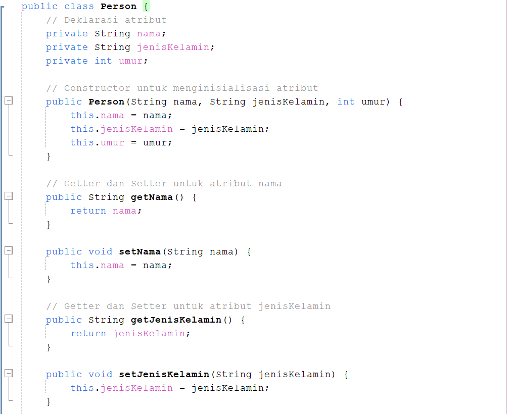
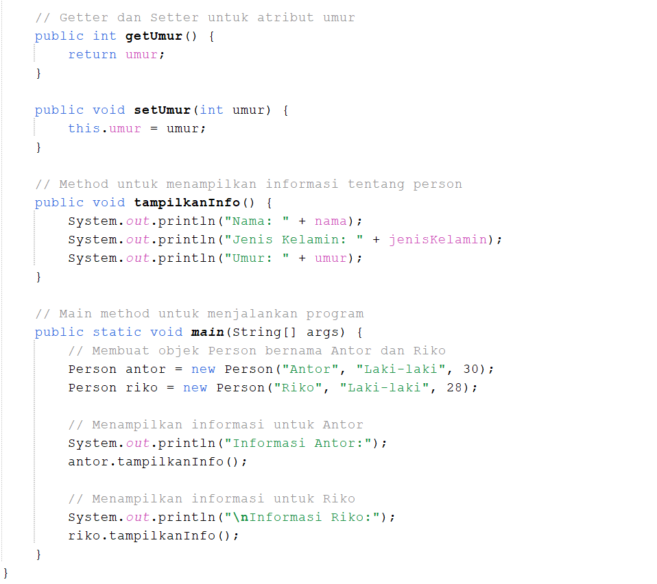
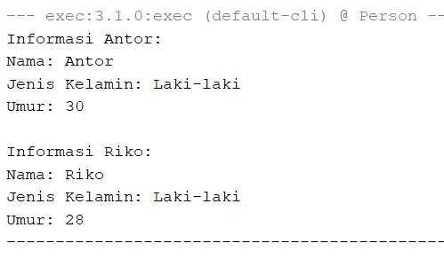
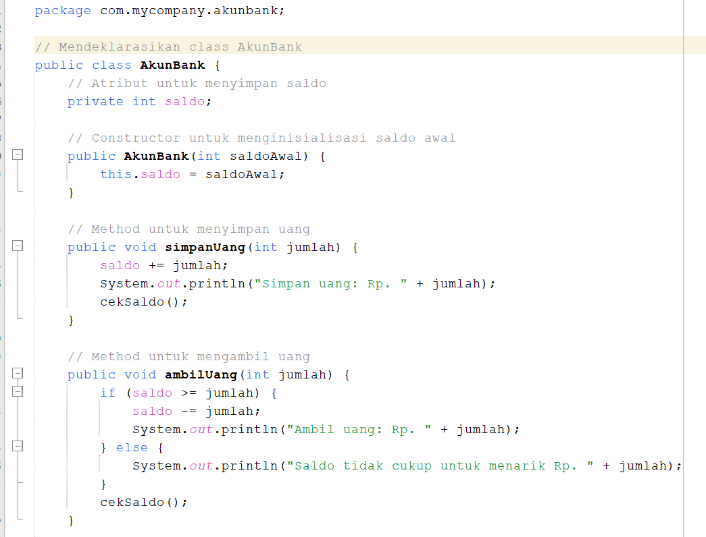
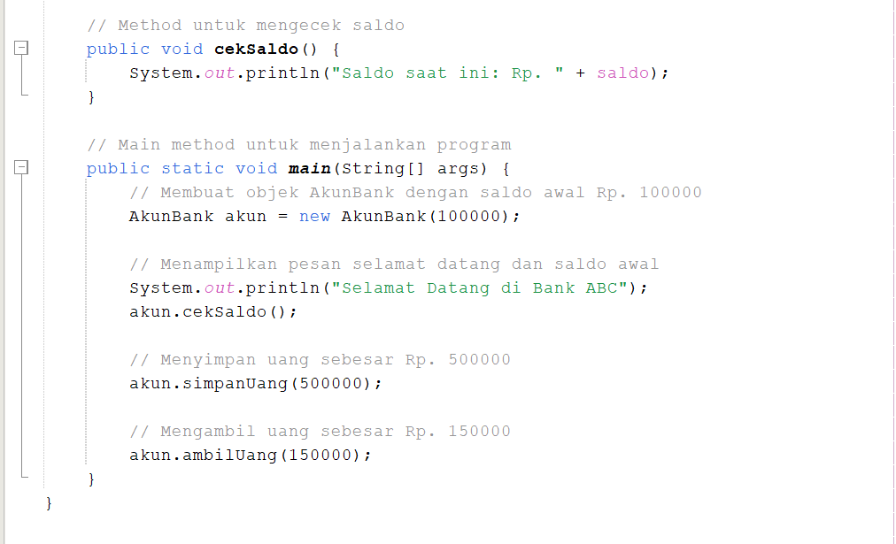
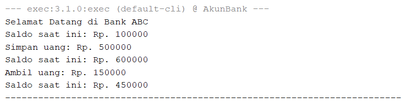

# Latihan-1
 1. Apa yang harus didefinisikan sebeum membuat objek?
 2. Buatlah gambar diagram class dan dua buah objek dari class Person bernama Antor dan Riko
 3. Buatlah gambar diagram objek AkunBank dengan instance method simpanUang, ambilUang dan cekSaldo

## Berikut adalah hal-hal yang perlu didefinisikan sebelum membuat objek:

1. Nama Class: Ini adalah identitas dari class yang akan digunakan untuk membuat objek.
2. Atribut: Variabel yang mendefinisikan karakteristik atau properti dari objek. Misalnya, untuk class Person, atributnya bisa berupa nama, umur, dan jenisKelamin.
3. Metode: Fungsi yang mendefinisikan tindakan atau perilaku yang dapat dilakukan oleh objek. Misalnya, class AkunBank dapat memiliki metode simpanUang(), ambilUang(), dan cekSaldo().
4. Constructor: Metode khusus yang digunakan untuk menginisialisasi objek ketika objek tersebut dibuat. Constructor biasanya digunakan untuk menetapkan nilai awal dari atribut.

## * Buatlah gambar diagram class dan dua buah objek dari class Person bernama Antor dan Riko

dari diagram tersebut objek anton dan riko belum ditambahkan. 

## berikut diagram class yang telah dimasukan dua objek

* diagram objek untuk Anton

| Anton : Person |
|----------------|
| Nama : Anton   |
| Jenis Kelamin : L |
| Umur : 25      |

Objek  anton adalah instance dari class Person, yang dimana atribut seperti nama, jenis kelamin, dan umur di isi biodata Anton 

 * diagram objek untuk Riko

| Riko : Person |
| --------------|
| Nama : Riko   |
| Jenis Kelamin : L |
| Umur : 35     |

Objek Riko adalah instance dari class Person, yang dimana atribut seperti nama, jenis kelamin, dan umur di isi biodata Riko

 * Diagram diatas menjelaskan bahwa Anton dan Riko merupakan objek atau instance dari class Person 

## * Buatlah gambar diagram objek AkunBank dengan instance method simpanUang, ambilUang dan cekSaldo

Diagram diatas merupakan diagram class Akun Bank, tetapi belum terdapat objek yang dimasukkan.

Berikut adalah diagram objek dari Akun Bank

| Akun saya : AkunBank |
| ---------------------|
| Saldo : 100000       |
| simpanUang(500000)   |
| ambilUang(150000)    |
| cekSaldo()           |

# Latihan 2
 ## * Buatlah kode program java untuk:
## 1. Mendeklarasikan class Person, dengan atribut Nama, JenisKelamin, Umur
## 2. Buatlah dua buah objek dari class Person bernama Anton dan Riko

## * INPUT

## * OTPUT

# Penjelasan
- Kelas person mendeklarasikan atribut nama, jeniskelamin, dan umur.
- Constructor digunakan untuk menginsialisasi atribut saat objek dibuat.
- Dua objek (anton dan riko) dibuat dengan menggunakan constructor dan datanya diisi.
- Method tampilkaninfo digunakan untuk menampilkan informasi dan objek tersebut.
    
# Latihan 3
## Buatlah kode java untuk: 
1. Mendeklarasikan class AkunBank dengan instance method simpanUang, ambilUang dan cekSaldo
2. Buat objek AkunBank dan tetapkan nilai saldo awal Rp. 100000, kemudian panggil 3 method tersebut dan tampilkan proses berikut:
  

## * INPUT

## * OTPUT

## Penjelasan:
- Atribut saldo: Menyimpan saldo yang diinisialisasi melalui constructor.
- Method simpanUang(int jumlah): Menambahkan jumlah uang yang disimpan ke dalam saldo.
- Method ambilUang(int jumlah): Mengurangi saldo sesuai jumlah uang yang diambil jika saldo mencukupi.
- Method cekSaldo(): Menampilkan saldo saat ini.
- Main Method: Membuat objek AkunBank, menampilkan pesan awal, dan memanggil metode simpanUang dan ambilUang sesuai skenario pada gambar.
- Ketika program dijalankan, hasil yang ditampilkan sesuai dengan yang diminta di gambar.

    

